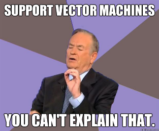
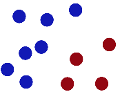
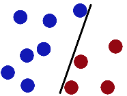
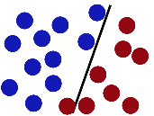
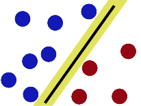
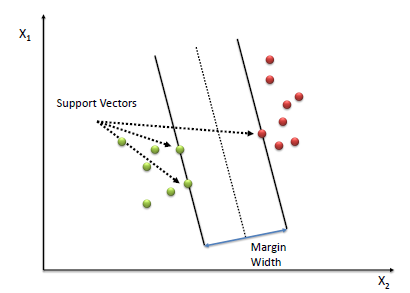
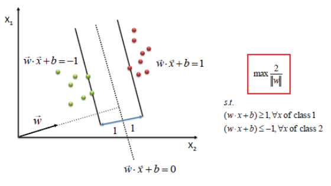
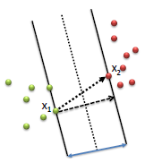
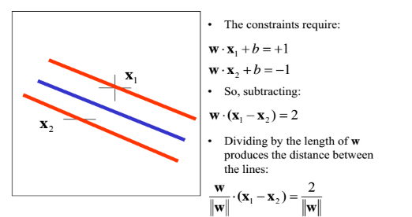
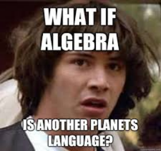

Support Vector Machine
----------------------

## Introduction

Think of machine learning algorithms as an armory packed with axes, sword, blades, bow, dagger etc. You have various tools, but you ought to learn to use them at the right time. As an analogy, think of ‘Regression’ as a sword capable of slicing and dicing data efficiently, but incapable of dealing with highly complex data. On the contrary, **‘Support Vector Machines’** is like a sharp knife – it works on smaller datasets, but on them, it can be much more stronger and powerful in building models.

**Support vector machines** are supervised learning models with associated learning algorithms that analyze data used for classification and regression analysis. Given a set of training examples, each marked as belonging to one or the other of two categories, an SVM training algorithm builds a model that assigns new examples to one category or the other, making it a non-probabilistic binary linear classifier.

## Intuition

- Imagine we have 2 colors of balls on the table that we want to separate.

- We get a stick and put it on the table, this works pretty well right?

- Some villain comes and places more balls on the table, it kind of works but one of the balls is on the wrong side and there is probably a better place to put the stick now.

    

- SVMs try to put the stick in the best possible place by having as big a gap on either side of the stick as possible.

- Boring adults the call balls data, the stick a classifier and the biggest gap trick optimization.

## Mathematics

A Support Vector Machine (SVM) performs classification by finding the hyperplane that maximizes the margin between the two classes. The vectors (cases) that define the hyperplane are the support vectors.

To define an optimal hyperplane we need to maximize the width of the margin (w).

Assumptions:

1. Let w be a vector of any length  to the median of the margin.
2. Let x be a vector pointing to an unknown data point.

Our **aim** is to find the best decision vector $$\overrightarrow x$$ which maximizes the width of the margin w.

**Decision Rule:**

- Classify unknown x as positive(class1) if
$$\overrightarrow w.\overrightarrow x > 0$$

- Constraint, for all positive sample vectors:
$$\overrightarrow w.\overrightarrow x \ge 1$$                      Eq. 1

- Constraint, for all negative(class2) sample vectors:
$$\overrightarrow w.\overrightarrow x \le -1$$                      Eq. 2

The dot product $$\overrightarrow w.\overrightarrow x$$ is the projection of vector x in the direction of w. If the projection is greater than a threshold (the median line) we classify the unknown sample as class1 else class2.  

The width of the  margin w can be calculated by taking the dot product between the difference of the 2 vectors $$x_2 - x_1$$ and a unit vector normal to the margin ie. $$ \frac w {\|w\|}$$ 

$$Width = \frac w {\|w\|} . (x_2 - x_1)$$ 

For “mathematical convenience” let us introduce a new variable $$y_i$$st.
    $$y_i = +1 for +ve $$
    $$y_i = -1 for -ve $$

Multiplying  Eq. 1 & Eq. 2 with yiwe can rewrite the constraints as:
    $$y_i.(\overrightarrow w.\overrightarrow x +b) \ge 1$$

  
Maximizing the width   $$\frac 2 {\|w\|}$$        is equivalent to minimizing $$\frac 1 2 {\|w\|^2}$$

We find w and b by solving the following objective function using Quadratic Programming.
$$Min\frac 1 2 {\|w\|^2}$$

## Conclusion

The beauty of SVM is that if the data is linearly separable, there is a unique global minimum value. An ideal SVM analysis should produce a hyperplane that completely separates the vectors (cases) into two non-overlapping classes. 
 
**Pros**

 - Accuracy 
 - Works well on smaller cleaner datasets 
 - It can be more efficient because it uses a subset of training points

**Cons**

 - Isn’t suited to larger datasets as the training time with SVMs can be high
 - Less effective on noisier datasets with overlapping classes

